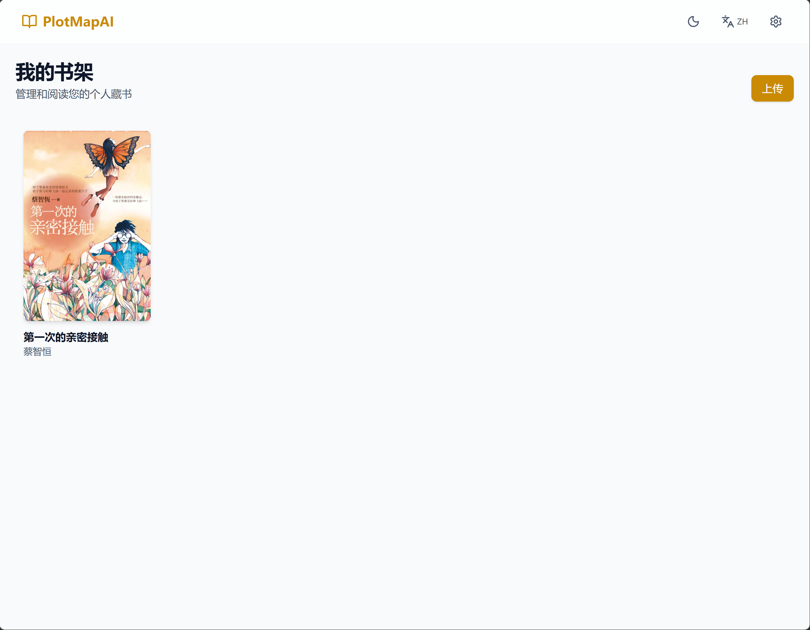
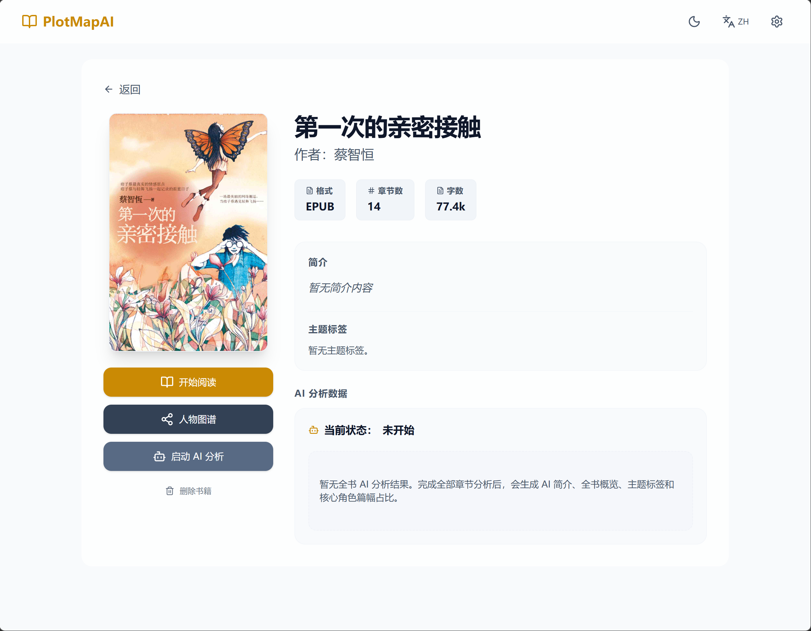
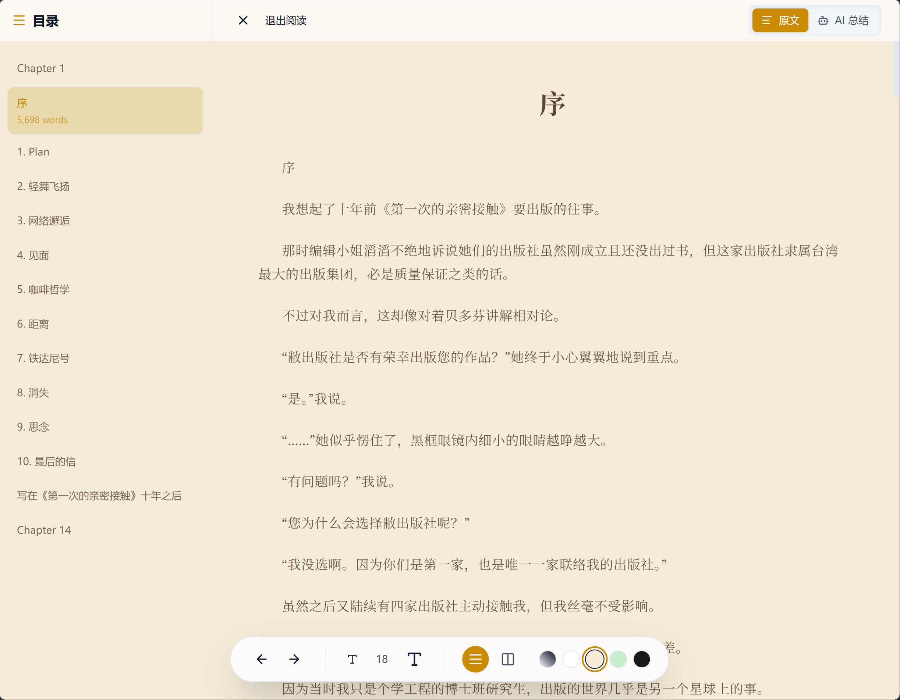
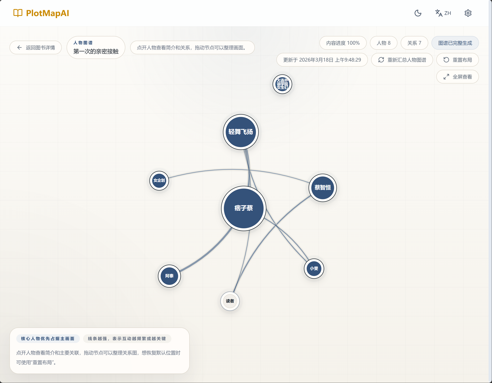
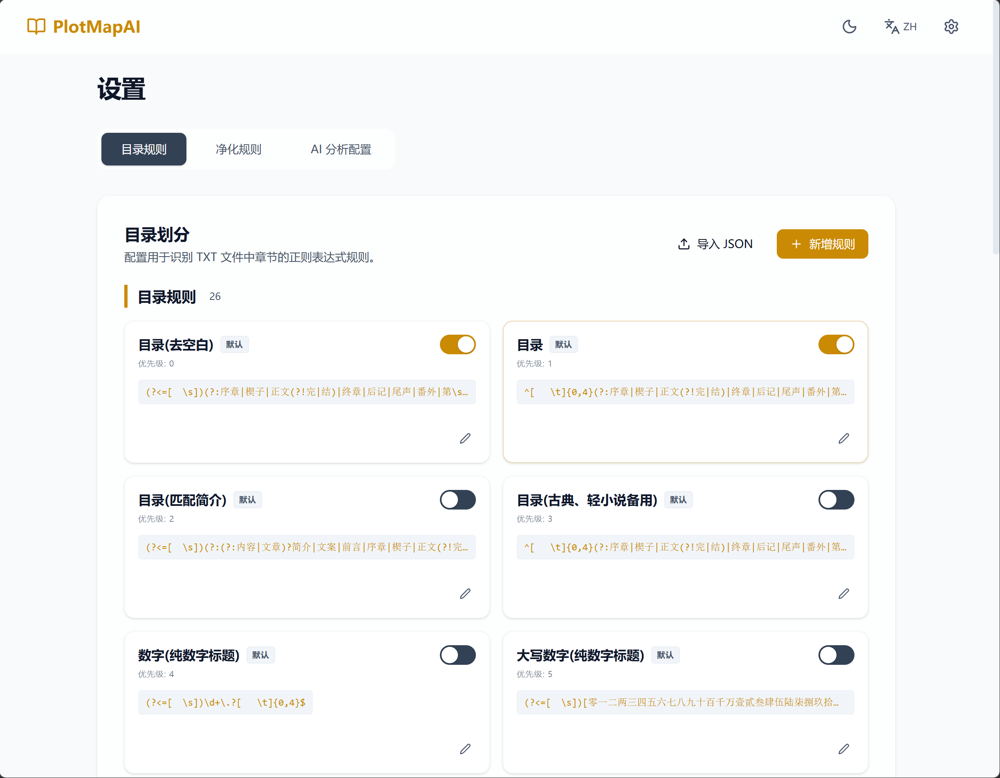

# PlotMapAI

[](https://www.python.org/)
[](https://flask.palletsprojects.com/)
[](https://react.dev/)
[](https://www.typescriptlang.org/)
[](https://www.sqlite.org/)
[](https://www.docker.com/)
[](LICENSE)

PlotMapAI 是一个面向长篇小说阅读与分析的本地化 Web 应用。它把“上传书籍、章节识别、正文净化、AI 章节分析、全书概览、人物图谱、阅读进度管理”整合到一个项目里，适合做小说阅读辅助、剧情梳理、角色关系整理和二次研究。

当前项目以单用户模式运行，已经预留了多用户和组织结构的数据模型，但默认只使用 `DEFAULT_USER_ID = 1`。

## 快速开始

### Docker Compose

最快的启动方式：

```bash
docker compose up --build
```

启动后默认访问：

- 前端 / API：`http://127.0.0.1:5000`
- API 前缀：`/api`

### 本地开发

后端：

```bash
cd app
uv sync --frozen --group dev
uv run python run.py
```

前端：

```bash
cd web
npm ci
npm run dev
```

开发联调地址：

- 前端：`http://127.0.0.1:5173`
- 后端：`http://127.0.0.1:5000`

## 典型使用流程

1. 打开设置页，配置 AI 接口地址、模型和 Token。
2. 上传 TXT 或 EPUB 小说。
3. 检查章节目录是否识别正确，必要时调整目录规则。
4. 如正文存在广告、水印、空行等问题，配置净化规则。
5. 在书籍详情页启动 AI 分析。
6. 分析完成后查看全书概览、主题标签、核心角色占比和人物图谱。
7. 在阅读页继续阅读，并自动保存阅读进度。

## 界面预览

### 书架



### 书籍详情



### 阅读器



### 人物图谱



### 设置页



## 主要能力

- 支持上传 `TXT` 和 `EPUB` 小说
- 自动识别章节并建立目录
- 支持导入和管理目录规则
- 支持导入和管理正文净化规则
- 提供阅读器模式，保存阅读进度、滚动位置和视图模式
- 基于 OpenAI-compatible 接口进行章节级 AI 分析
- 自动生成全书简介、全书概览、主题标签和核心角色占比
- 生成可交互的人物图谱，支持拖拽、缩放、平移和节点详情查看
- 支持暂停、继续、重启分析任务，以及在已有章节分析基础上重新汇总人物图谱
- 内置单元测试和 GitHub Actions 持续集成

## 技术栈

### 前端

- React 19
- TypeScript
- Vite 8
- React Router 7
- Tailwind CSS 4
- i18next
- Vitest + Testing Library + MSW

### 后端

- Flask 3
- SQLAlchemy 2
- SQLite
- uv
- pytest

### AI 接入

- 采用 OpenAI-compatible Chat Completions 风格接口
- 可在设置页配置：
  - `API Base URL`
  - `API Key`
  - `Model Name`
  - `Context Size`

## 项目结构

```text
PlotMapAI/
├── app/                    # Flask 后端
│   ├── routes/             # 小说、阅读、分析、设置 API
│   ├── services/           # EPUB/TXT 解析、净化、AI 分析、后台任务
│   ├── tests/              # 后端单元测试
│   ├── resources/          # 默认规则等静态资源
│   ├── config.py           # 后端配置
│   ├── database.py         # 数据库初始化与会话管理
│   ├── models.py           # SQLAlchemy 模型
│   └── run.py              # 本地开发入口
├── web/                    # React 前端
│   ├── src/
│   │   ├── api/            # 前端 API 封装
│   │   ├── components/     # 组件
│   │   ├── context/        # 主题上下文
│   │   ├── i18n/           # 中英文文案
│   │   ├── pages/          # 书架、详情、阅读、图谱、设置页
│   │   └── test/           # 前端测试基建
│   └── package.json
├── data/                   # 宿主机持久化数据目录（Docker）
├── uploads/                # 上传文件与封面目录（Docker）
├── docker-compose.yml
├── Dockerfile
└── README.md
```

## 核心页面

- `/`
  - 书架页，负责展示已上传书籍并触发上传
- `/novel/:id`
  - 书籍详情页，负责展示简介、AI 状态、全书概览和分析操作
- `/novel/:id/read`
  - 阅读器页，支持章节导航、净化阅读和进度保存
- `/novel/:id/graph`
  - 人物图谱页，突出角色关系网络和点击查看人物详情
- `/settings`
  - 设置页，负责目录规则、净化规则和 AI 提供方配置

## 核心后端模块

### 小说管理

- [`app/routes/novels.py`](app/routes/novels.py)
- 支持上传、列表、详情、删除、封面读取
- TXT 通过规则切章
- EPUB 解析元数据、章节和封面
- 对相同物理文件做共享引用，删除小说前会检查是否还有其他记录指向同一路径

### 阅读器

- [`app/routes/reader.py`](app/routes/reader.py)
- 提供章节目录、章节正文、阅读进度接口
- 阅读时会应用已启用的净化规则

### AI 分析

- [`app/services/analysis_runner.py`](app/services/analysis_runner.py)
- [`app/services/ai_analysis.py`](app/services/ai_analysis.py)
- 采用“章节分块分析 + 全书概览汇总”的两段式流程
- 章节先按上下文大小切块，再逐块提交给模型
- 每章会保存摘要、关键点、人物、关系、标签
- 全书概览会聚合已有章节分析结果，再生成：
  - `bookIntro`
  - `globalSummary`
  - `themes`
  - `characterStats`
  - `relationshipGraph`
- 人物关系标签会做规范化归类，例如把变体标签收口为统一关系
- 非法角色关系会被跳过，不会因为单条脏结果让整次概览失败

### 设置系统

- [`app/routes/settings.py`](app/routes/settings.py)
- 支持管理目录规则
- 支持导入 Legado 风格的净化规则
- 支持配置和测试 AI 接口

## API 概览

主要接口按职责分成四组：

### 小说

- `GET /api/novels`
- `POST /api/novels/upload`
- `GET /api/novels/:id`
- `DELETE /api/novels/:id`
- `GET /api/novels/:id/cover`

### 阅读

- `GET /api/novels/:id/chapters`
- `GET /api/novels/:id/chapters/:chapterIndex`
- `GET /api/novels/:id/reading-progress`
- `PUT /api/novels/:id/reading-progress`

### AI 分析

- `GET /api/novels/:id/analysis/status`
- `GET /api/novels/:id/analysis/overview`
- `GET /api/novels/:id/analysis/chapters/:chapterIndex`
- `GET /api/novels/:id/analysis/character-graph`
- `POST /api/novels/:id/analysis/start`
- `POST /api/novels/:id/analysis/pause`
- `POST /api/novels/:id/analysis/resume`
- `POST /api/novels/:id/analysis/restart`
- `POST /api/novels/:id/analysis/refresh-overview`

### 设置

- `GET/POST/PUT/DELETE /api/settings/toc-rules`
- `POST /api/settings/toc-rules/upload`
- `GET/POST/PUT/DELETE /api/settings/purification-rules`
- `POST /api/settings/purification-rules/upload`
- `GET /api/settings/ai-provider`
- `PUT /api/settings/ai-provider`
- `POST /api/settings/ai-provider/test`

## 数据模型概要

主要模型定义在 [`app/models.py`](app/models.py)：

- `Novel`
- `NovelRawContent`
- `Chapter`
- `ReadingProgress`
- `TocRule`
- `PurificationRule`
- `AiProviderConfig`
- `NovelAnalysisJob`
- `NovelAnalysisChunk`
- `ChapterAnalysis`
- `NovelAnalysisOverview`

项目当前是单用户模式，但模型中已经保留了 `User`、`Organization`、`OrgMember` 相关结构，便于未来扩展。

## 运行方式

### 方式一：Docker Compose

这是最简单的启动方式。

```bash
docker compose up --build
```

默认行为：

- 后端监听 `5000`
- SQLite 数据持久化到宿主机 `./data`
- 上传文件持久化到宿主机 `./uploads`
- 如果没有显式提供 `SECRET_KEY`，应用会在首次启动时自动生成并写入宿主机 `./data/secret_key`（容器内路径为 `/app/data/secret_key`），后续重建容器会继续复用

启动后可访问：

- 后端 API: `http://127.0.0.1:5000/api/...`
- 前端静态页：如果使用 Docker 镜像内置前端，则由 Flask 同端口提供

### 方式二：本地开发

#### 1. 启动后端

建议使用 `uv`。

```bash
cd app
uv sync --frozen --group dev
uv run python run.py
```

后端默认运行在：

```text
http://127.0.0.1:5000
```

#### 2. 启动前端

```bash
cd web
npm ci
npm run dev
```

前端开发服务器默认运行在：

```text
http://127.0.0.1:5173
```

Vite 已经代理 `/api` 到后端 `http://127.0.0.1:5000`，见 [`web/vite.config.ts`](web/vite.config.ts)。

## 首次使用建议流程

1. 启动项目
2. 打开设置页，先配置 AI 提供方
3. 上传一本 TXT 或 EPUB 小说
4. 检查目录识别是否正确
5. 如有需要，调整目录规则或正文净化规则
6. 在书籍详情页启动 AI 分析
7. 分析完成后查看：
   - 书籍简介
   - 全书概览
   - 主题标签
   - 核心角色占比
   - 人物图谱

## 配置说明

后端配置定义在 [`app/config.py`](app/config.py)。

### 常用环境变量

| 变量名 | 作用 | 默认值 |
| --- | --- | --- |
| `SECRET_KEY` | Flask 签名密钥。若未提供，则优先尝试读取持久化文件，不存在时自动生成。 | 无固定默认值 |
| `SECRET_KEY_FILE` | 指定持久化 secret 文件路径。 | `app/data/secret_key` |
| `DATABASE_URL` | 数据库连接串 | `sqlite:///app/data/plotmap.db` 或本地 `app/data/plotmap.db` |
| `UPLOAD_DIR` | 上传目录 | `app/uploads` |
| `MAX_CONTENT_LENGTH` | 上传体积限制 | `104857600`（100MB） |

### `.env` 的作用

- 本地直接运行后端时，`app/.env` 会被加载
- Docker Compose 主要使用容器环境变量和挂载卷
- 当前项目已经支持自动生成并持久化 `SECRET_KEY`，不再要求手动在 `.env` 中固定写死

可参考 [`app/.env.example`](app/.env.example)。

## 测试与质量检查

### 后端测试

```bash
cd app
uv sync --frozen --group dev
uv run pytest
```

### 前端检查

```bash
cd web
npm ci
npm run lint
npm run test
npm run build
```

## GitHub Actions

项目已经配置 GitHub Actions：

- [`CI`](.github/workflows/ci.yml)
  - 后端单元测试
  - 前端 lint
  - 前端单元测试
  - 前端构建
- [`Code Scanning`](.github/workflows/codeql.yml)
  - Python CodeQL 扫描
  - JavaScript / TypeScript CodeQL 扫描

这些工作流会在每次 `push` 和 `pull_request` 时触发。

## 常见问题

### 为什么第一次启动后会生成 `data/secret_key`

项目会优先读取环境变量里的 `SECRET_KEY`。如果没有配置，则会在首次启动时自动生成一个随机密钥并持久化到 `data/secret_key`，后续复用这个文件，避免容器重建后登录态或签名能力失效。

### Docker 重建后数据会不会丢

不会，只要你保留宿主机上的 `./data` 和 `./uploads` 目录挂载：

- `./data` 保存数据库和 `secret_key`
- `./uploads` 保存上传文件和封面

### 为什么人物图谱要先完成章节分析

人物图谱依赖章节级分析结果做聚合和二次 AI 汇总，所以至少要先完成一轮章节分析，才能得到稳定的全书人物关系网络。

## 当前实现特点与限制

- 当前默认是单用户模式
- AI 分析依赖你自行配置的 OpenAI-compatible 服务
- 后台任务使用进程内线程，不是独立任务队列
- 数据库存储默认使用 SQLite，适合单机、自托管和轻量部署
- 前端已支持中英文切换和浅色/深色主题

## 后续可扩展方向

- 用户登录与权限体系
- 多用户隔离与组织共享
- 独立任务队列和更稳健的分析调度
- 更细粒度的分析日志与审计能力
- 更完整的导入导出能力
- 覆盖率统计与 PR 状态徽章

## License

This project is licensed under the MIT License. See [`LICENSE`](LICENSE).
